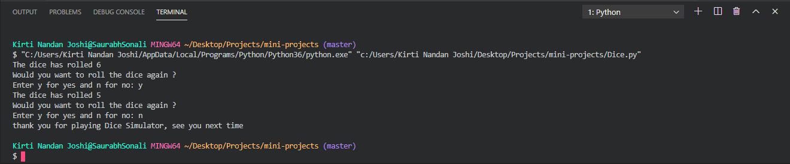
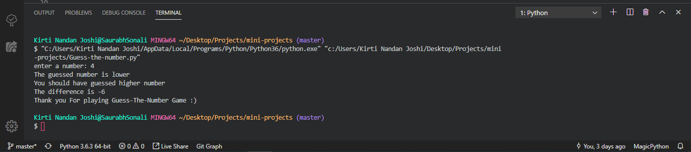
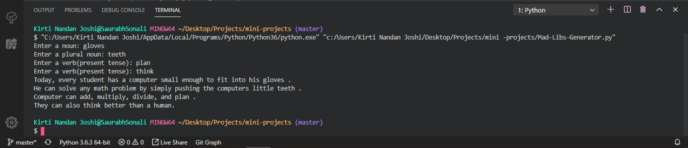
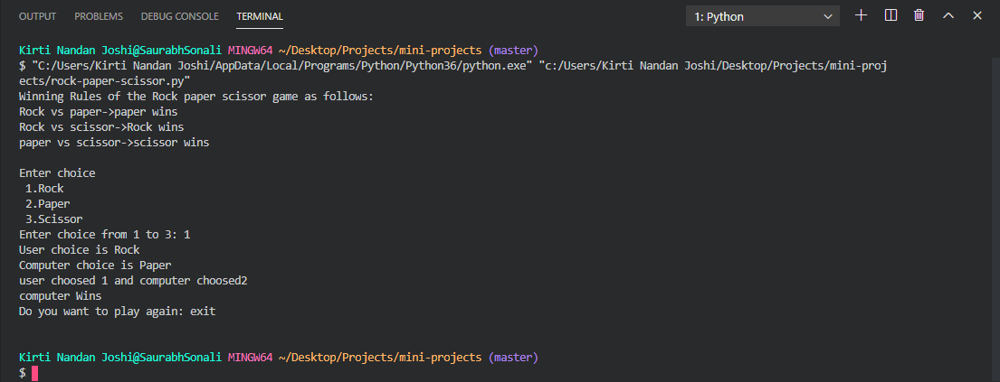
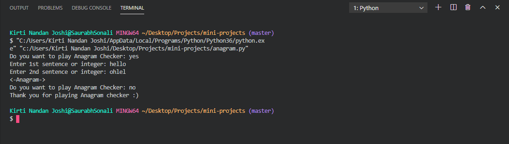

# mini-projects
This contains bunch of mini projects written in python.
This repository is in development stage

# 1. Dice project

The will randomly choose a number between 1 and 6.

The program will print what that number is. It should then ask you if you’d like to roll again. 

We need to set the min and max number that your dice can produce. 

For the average die, that means a minimum of 1 and a maximum of 6. 

A function is used that randomly grabs a number within that range and prints it.

# 2. Guess The Number

The program will have random library

User will need to guess any number between the range, If the number is equal to randomly generated number it will print "You guessed the number correctly" 

If the number is less than randomly generated number, it will prompt "The guessed number is lower, Pls guess higher number" 

If the number is greater than the randomly generated number, it will prompt "The guessed number is higher, Pls guess lower" 

The program will also give the difference between the user number and randomly generated number.

# 3. Mad libs Generator

The program will take user input with noun, pronoun, numbers etc.

It will then concatenate these strings with the pre-defined template.

It will then print all the sentences with the user inputs strings.

# 4. Rock-Paper-Scissor Game 

This game will be played by computer and user.

The user has to choose from 1 to 3 values. 

Value 1 is for Rock, Value 2 is for Paper and Value 3 is for Scissor. 
In the other hand computer will randomly choose the value for 1 to 3 using random library.

The user has to submit a value and it will compute who has won, If user and computer 
generated the same value it will print "Both Wins".

Then it will prompt user to continue the game or not.

ld

# 5. Anagram Checker

This project will take 2 input from user. Input may be string or integer.

It will check if both of the string are equal using sorted() method. 
If both are same then it is anagram, else not a anagram. 

It will first ask user to play anagram checker or not.
If player enters no the prohram will terminate.

